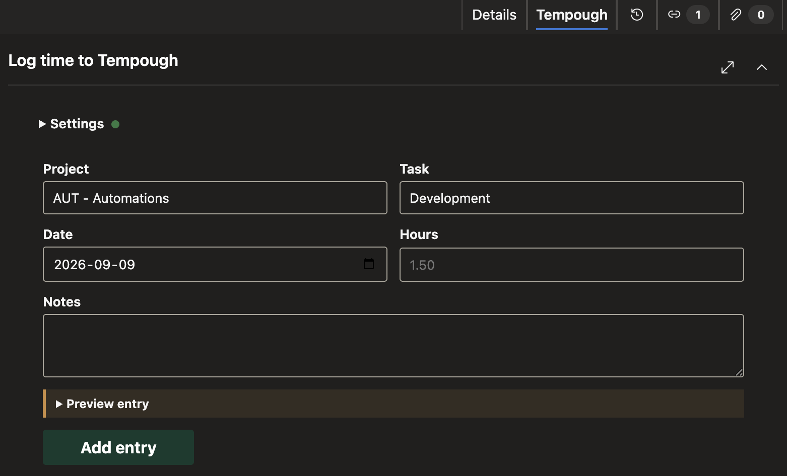

# Time Entry for Tempough

Create [Tempough](https://www.tempough.com) time entries from an Azure DevOps work item. Each entry includes the Azure DevOps project code,
work item number, and title.

---

## Features

Create entries using active Tempough projects and tasks, reuse your last selections, and preview notes before submitting.

## Requirements

- A [Tempough](https://www.tempough.com) account and API URL and token.
- Permission to install the extension in your Azure DevOps organization.

## Get started

1. Install the extension in your Azure DevOps organization.
2. Open an Azure Boards work item.
3. Expand **Log time to Tempough**.
4. Open **Settings**, enter the Tempough API URL and API token, and save the connection.
5. Choose a project and task, complete the time-entry fields, and select **Add entry**.

## Data and security

### Data access and storage

The extension reads the current work item's ID, title, and type from Azure DevOps via the extension SDK.

Your Tempough API URL, API token, and last project and task selection are stored in Azure DevOps
[user-scoped Extension Data](https://learn.microsoft.com/en-us/azure/devops/extend/develop/data-storage?view=azure-devops#data-scoping).

The API token is stored in Azure DevOps user-scoped Extension Data. API requests send it from your browser to the configured Tempough endpoint
as a bearer token.

The extension does not include publisher-operated analytics, logging or telemetry.

See the included [privacy policy](PRIVACY.md) for details.

### Permissions

- **Work items (`vso.work`):** reads context from the work item where the form is displayed.
- **Extension data (`vso.extension.data_write`):** stores user's connection info and last selections.

## Other Remarks

This is an independent integration published by [IT Nobody, LLC](https://itnobody.com). It is not affiliated with, endorsed by, or sponsored by 
[Tempough](https://tempough.com).

Tempough is a trademark of its respective owner. Use of the name identifies the service with which this independent extension interoperates.
